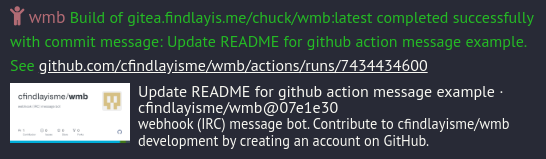

# Examples of usage
This document is just to show some examples of how to use wmb. See the [API Reference](API%20Reference.md) for more detailed information on how to use the endpoints.

## Send a message to IRC from CLI
```
curl -X POST -H "Content-Type: application/json" -d '{"message":"Hello, World! stuff", "password":"password"}' http://localhost:8080/message
```
Or, if you prefer to use just a URL:
```
curl http://localhost:8080/message?Message=Hello,%20World!&Password=password

```
Note using this second method, the Message and Password parameters are case sensitive.

## GitHub Actions pipeline success/failure message
Set the secret `WMB_PASSWORD` in your GitHub repo, then add the following to your pipeline after the step you wish to send out success/failure messages:
```
- name: Notify IRC Success
    run: |
    export COMMIT_MSG=$(git log -1 --pretty=%B)
    export MESSAGE="Build of project completed successfully with commit message: $COMMIT_MSG. See https://github.com/${{ github.repository }}/actions/runs/${{ github.run_id }}"
    curl -X POST -H "Content-Type: application/json" -d "{\"message\": \"$MESSAGE\", \"password\": \"${{ secrets.WMB_PASSWORD }}\", \"colourcode\": 3}" https://domain/wmb/message
    if: success()

- name: Notify IRC Failure
    run: |
    export COMMIT_MSG=$(git log -1 --pretty=%B)
    export MESSAGE="Build of project failed with commit message: $COMMIT_MSG. See https://github.com/${{ github.repository }}/actions/runs/${{ github.run_id }}"
    curl -X POST -H "Content-Type: application/json" -d "{\"message\": \"$MESSAGE\", \"password\": \"${{ secrets.WMB_PASSWORD }}\", \"colourcode\": 4}" https://domain/wmb/message
    if: failure()
```

