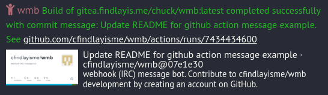

Very simple bot to send IRC messages from webhooks.

In the future I plan to:
- Allow for things to "subscribe" to webhooks, so they can recieve a webhook from wmb on something like a message in a channel for example
- Create some more types of events that can be sent to IRC (ie, kick, ban, mode, topic, etc)

These things will allow for easy "bolt-on" functionality without making the bot itself overly complicated.

## Launching
See `docker-compose.yml` for an example of how to launch the bot. Just have to change envionment variables and run `docker-compose up -d`

## Envionment Variables
- `IRC_SERVER` in server:port format
- `IRC_CHANNEL` 
- `IRC_NICK`
- `PASSWORD` (Not IRC password, but password for the webhook. Sort of like an API key you define)
- `NICKSERV_PASSWORD` (Optional)
- `OTHER_IRC_CHANNELS` (Optional, comma separated list of channels to join on launch that are not the main channel)
- `PORT` (Optional, what port to have the webserver listen on, defaults to 8080)

## JSON format
POST to /message with the following JSON format:
```
{
    "message": "Hello, World!",
    "password": "password",
    "colourcode": 1
}
```
Colourcode is optional, and is the colour of the message in IRC. See https://modern.ircdocs.horse/formatting.html for a list of colours, where the numbers 1-15 are used.

## Send a message to IRC from CLI
```
curl -X POST -H "Content-Type: application/json" -d '{"message":"Hello, World! stuff", "password":"password"}' http://localhost:8080/message
```
Or, if you prefer to use just a URL:
```
curl http://localhost:8080/message?Message=Hello,%20World!&Password=password

```
Note using this second method, the Message and Password parameters are case sensitive.
## nginx reverse proxy
```
location /wmb {
    rewrite /wmb/(.*) /$1  break;
    proxy_pass http://127.0.0.1:8080;
}
```

In your desired config. Then you can POST to domain.tld/wmb/message to send out a webhook.

## GitHub Actions pipeline success/failure message
Set the secret `WMB_PASSWORD` in your GitHub repo, then add the following to your pipeline after the step you wish to send out success/failure messages:
```
- name: Notify IRC Success
    run: |
    export COMMIT_MSG=$(git log -1 --pretty=%B)
    export MESSAGE="Build of project completed successfully with commit message: $COMMIT_MSG. See https://github.com/${{ github.repository }}/actions/runs/${{ github.run_id }}"
    curl -X POST -H "Content-Type: application/json" -d "{\"message\": \"$MESSAGE\", \"password\": \"${{ secrets.WMB_PASSWORD }}\", \"colourcode\": 3}" https://domain/wmb/message
    if: success()

- name: Notify IRC Failure
    run: |
    export COMMIT_MSG=$(git log -1 --pretty=%B)
    export MESSAGE="Build of project failed with commit message: $COMMIT_MSG. See https://github.com/${{ github.repository }}/actions/runs/${{ github.run_id }}"
    curl -X POST -H "Content-Type: application/json" -d "{\"message\": \"$MESSAGE\", \"password\": \"${{ secrets.WMB_PASSWORD }}\", \"colourcode\": 4}" https://domain/wmb/message
    if: failure()
```



## I don't want to use docker
Fine, just clone the repo and run `make`. A binary will be built in the root of the repo called `wmb` that will work just as good as the docker container, just set your envionment variables and run it.

Note: You'll need to have go installed to build the binary.

## Resource usage
For those of you running this on tiny VMs, the resource usage is pretty low - barely any CPU usage, and about 12MB of RAM usage (which is pretty good considering it's running an IRC client and a web server.)

## But why?
I wanted to get notifications in IRC from my various systems, and particularly my GitHub action pipelines. This does that.